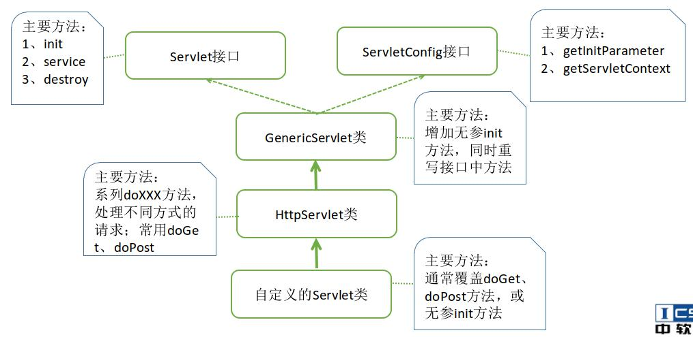

# Servlet

> Servlet 是 JavaEE 规范中的 Web 开发组件,运行在服务器端的 java 程序.




## Servlet 特点

1. 运行在服务器端
2. 需要 Servlet 容器的支持(如:Tomcat)
3. Servlet 可以具体成一个 Java 类，遵守一定的开发规范,比如继承`HttpServlet`
4. 通过浏览器访问 Servlet，Servlet 返回给浏览器动态页面


## Servlet 生命周期

1. Tomcat 启动,各个方法没有执行
2. 第一次访问某Servlet时:
   1. 构造器
   2. init()方法（先有参，再无参）
   3. service()方法
   4. do×××()方法
3. 第二次以及以后访问时：
   1. service()方法
   2. do×××()方法
4. Tomcat销毁该Servlet对象前：
   1. destroy()方法


**ps：**  
- 方法执行次数
  * 构造方法,初始化方法执行一次
  * service()方法 doXXX()执行多次
  * 销毁方法 destroy()方法执行一次

```java
import javax.servlet.ServletConfig;
import javax.servlet.ServletException;
import javax.servlet.http.HttpServlet;
import javax.servlet.http.HttpServletRequest;
import javax.servlet.http.HttpServletResponse;
import java.io.IOException;

class HelloServlet extends HttpServlet {
    private static final long serialVersionUID = 1L;

    /**
     * @see HttpServlet#HttpServlet()
     */
    public HelloServlet() {
        System.out.println("HelloServlet()构造方法...");
    }

    /**
     * @see HttpServlet#doGet(HttpServletRequest request, HttpServletResponse response)
     */
    protected void doGet(HttpServletRequest request, HttpServletResponse response) throws ServletException, IOException {
        // TODO Auto-generated method stub
        System.out.println("doGet()");
        response.getWriter().append("Served at: Hello Servlet !").append(request.getContextPath());
    }

    @Override
    protected void service(HttpServletRequest req, HttpServletResponse resp) throws ServletException, IOException {
        System.out.println("service()方法...");
        super.service(req, resp);
    }

    @Override
    public void init(ServletConfig config) throws ServletException {
        System.out.println("init(有参数)方法...");
        super.init(config);
    }

    @Override
    public void init() throws ServletException {
        // TODO Auto-generated method stub
        System.out.println("init()无参数方法...");
        super.init();
    }


    /**
     * @see HttpServlet#doPost(HttpServletRequest request, HttpServletResponse response)
     */
    protected void doPost(HttpServletRequest request, HttpServletResponse response) throws
            ServletException, IOException {
        // TODO Auto-generated method stub
        System.out.println("doPost()");
        doGet(request, response);
    }

    @Override
    public void destroy() {
        System.out.println(" destroy()方法");
    }
}
```

## Servlet 的特性

**多线程单实例**

Web 应用服务器会为每个客户端的连接启动一个线程来服务，多个客户端访问同时访问一个Servlet时，服务器不会创建多个Servlet实例。  
第一次访问 Servlet 时,服务器将创建一个该 Servlet 类的对象,并调用 doXXX 方法生成响应;多个客户端访问同一个 Servlet 时,不再创建新的对象,而是共用同一个 Servlet 对象。

验证：
    启动服务器，并用多个浏览器同时访问HelloServlet，查看其打印结果。