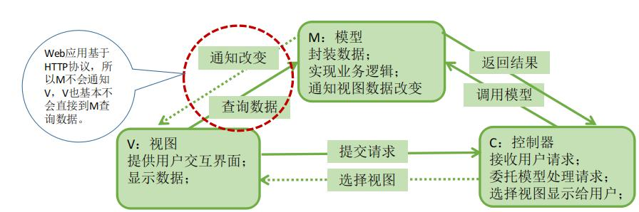

# MVC

> Model View Controller 模型视图控制器

## MVC 作用

MVC 模式将软件的代码按照模型(M)、视图(V)、控制器(C)划分为三个角色
- V:视图,提供用户交互页面,显示数据
- C:控制器,接收用户的请求,调用模型处理请求,选择视图显示给用户
- M:模型,封装数据,实现业务逻辑,返回结果,让控制器将结果渲染在视图上

**使用 JavaEE Web 组件开发 Web 应用时,MVC 中的不同角色**
- V:视图,JSP
- C:控制器 Servlet
- M:模型 Java 类
  1. 业务层:Service 层
  2. 数据访问层:Dao 层
  3. 实体类:Domain

## MVC 的优势

1. 耦合性低:视图层和业务层分离,耦合性降低,可以独立修改;
2. 重用性高:可以用不同的视图访问模型部分,实现在不同终端上访问应用;
3. 可维护性高:视图与业务分离,降低了维护成本

## 控制器和视图之间共享数据

控制器和视图之间共享数据一般使用请求、会话、上下文范围的属性进行

**使用原则:**
    尽量用范围小的属性,即,请求范围内共享即可就用请求,以此类推;否则会造成资源浪费,降低安全性。

**请求转跳方式：**
1. redirect:调用响应接口的 sendRedirect 方法,响应重定向,相当于重新请求新的资源,当前请求对象不会到目标资源;
2. forward: 调用请求转发器接口的 forward 方法,请求转发,将当前的请求、响应对象转发到目标资源;
3. include:调用请求转发器接口的 include 方法,动态包含,将目标资源的请求、响应对象包含到当前资源

