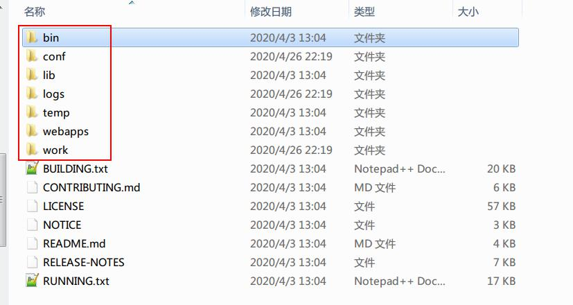
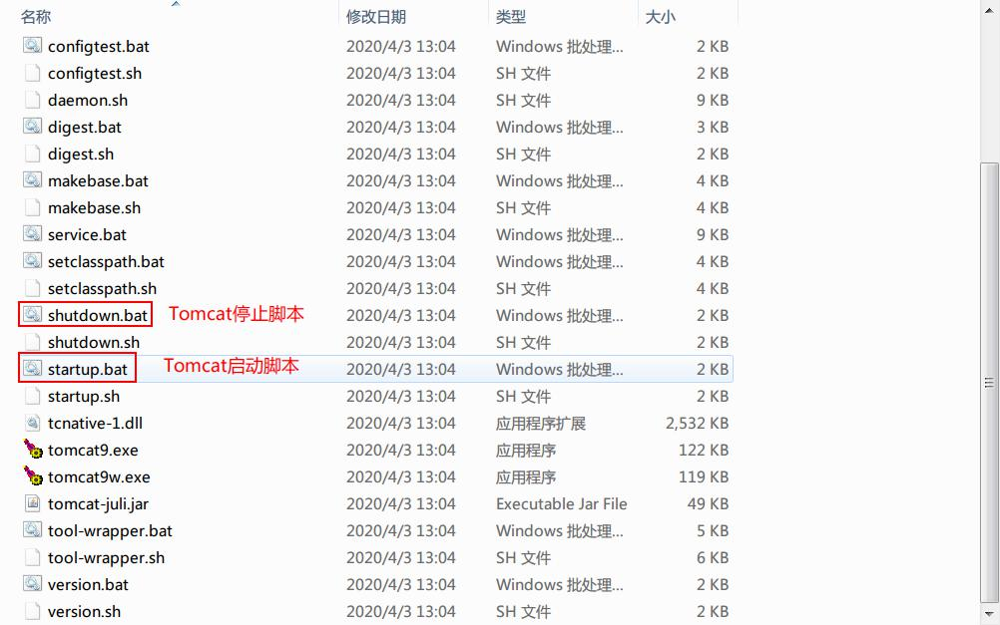
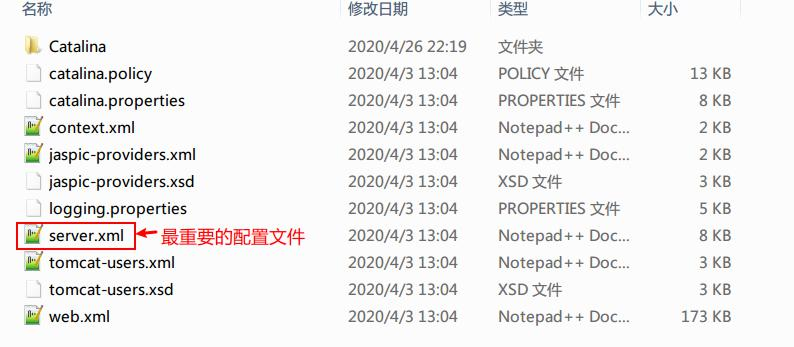
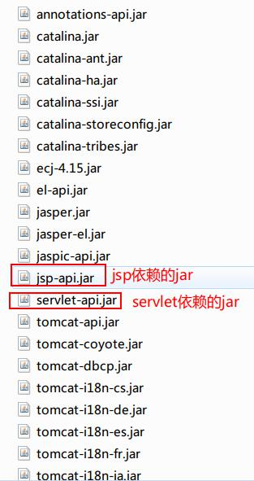
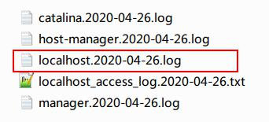
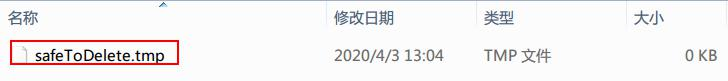
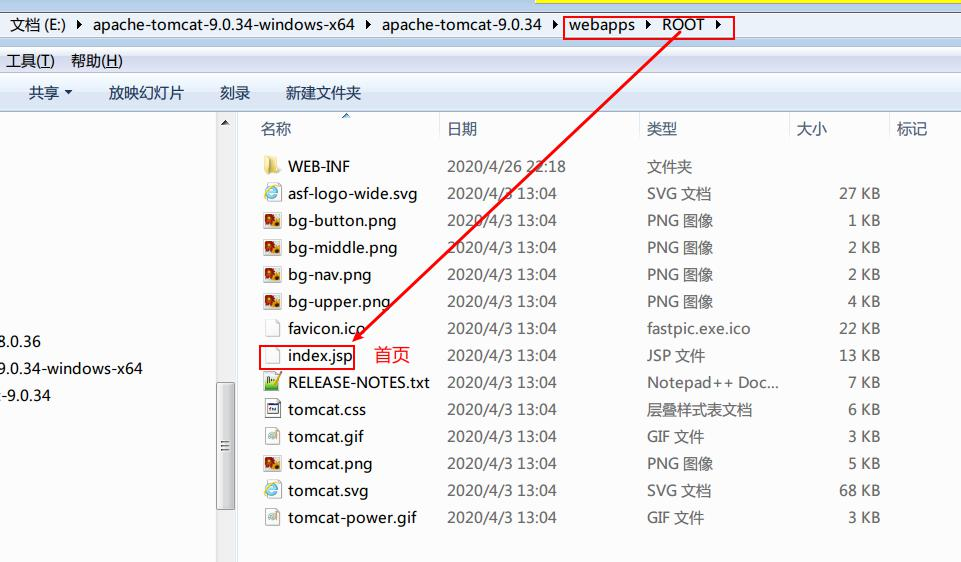
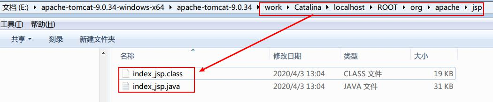

# Web入门

## Web架构

### C/S

Client/Server:客户端/服务器的简称,又称为胖客户端,需要在电脑上安装特定的软件.例如:QQ

### B/S

Browser/Server:浏览器/服务器的简称,又称为瘦客户端,不需要在电脑上安装特定的软件,只需在电脑上安装一个浏览器即可. 例如:在浏览器访问一个百度网页.

### C/S 和 B/S 区别

1. C/S 需要安装客户端软件,但是操作往往更为便捷,用户体验好,安全性好;  
2. B/S 不需要安装客户端软件,但是用户体验往往不如 C/S 好,安全性也较 C/S 要低

### RIA

1. 定义  
    Rich Internet Applications:富客户端网络应用
2. 目标  
    1. 基于 B/S 架构  
    2. 在浏览器实现与胖客户端(C/S)类似的用户体验,比如:局部刷新,拖拽功能.

## 分类

### Web 站点

Web Site,也称为 Web 网站,例如:某公司用来宣传的网站就是 Web 站点,用户浏览公司的信息,该站点不提供服务.属于静态站点.

### Web 应用

Web Application,就是通过浏览器访问的应用程序,为用户提供相关的服务,属于动态网站.例如:京东,淘宝,天猫

### HTTP 服务器

1. 定义  
    Web 服务器,提供网上信息浏览服务
2. 例子:  
    apache nginx IIS
3. 特点  
    使用浏览器访问 web 站点或者 web 应用,必须通过 HTTP 服务器.

### Web 应用服务器

1. 定义  
    能够运行服务器上的应用程序,并将结果返回给客户端浏览器的软件  
2. 例子  
    Tomcat 就是 Web 应用服务器，还有JBoss、Resin、GlassFish 4
    补充：Weblogic bea oracle、Websphere IBM
3. 特点  
    兼具 HTTP 服务器的部分功能.

## Web 应用的核心技术

### CGI

Common Gateway Interface :通用网关接口,web 应用服务器提供信息服务的标准接口,目前使用较少

### .net

微软公司的企业应用框架，如:Asp.net、Ado.net，中小型企业使用，不能跨平台

### php

php 是一个相对易学的 web 开发技术,在互联网小型应用中使用广泛.

### JavaEE

Oracle 公司的企业应用框架，在大型的企业应用广泛。例如:Servlet,JSP 是 Web 开发组件

## Tomcat

### 什么是 Tomcat

Tomcat 是 Web 应用服务器,又称为 Servlet Container(Servlet 容器)

### Tomcat 的特点

1. 开源
2. 免费
3. 中小型应用和并发访问用户不是很多的情况下广泛使用
4. 是开发调试 Servlet/Jsp 程序的首选

### Tomcat 的目录结构

1. bin
    Tomcat 的启动,停止的批处理脚本和 shell 脚本  
    
2. conf
    Tomcat 的相关配置文件  
    
3. lib
    Tomcat 服务器的依赖库目录,包括 Tomcat 服务器运行环境的依赖的 jar 包  
    
4. logs
    Tomcat 默认的日志存放目录  
    
5. temp
    Tomcat 运行过程中产生的临时文件  
    
6. webapps
    Tomcat 默认的 web 应用部署目录  
    
7. work
    jsp 代码生成和编译后产生的 class 目录
    

### Tomcat 启动

1. 配置Javahome
2. 进入 bin 目录
3. 双击 startup.bat 启动 Tomcat
4. 在浏览器地址栏输入：http://localhost:8080
5. 解决 Tomcat 控制台的乱码
    1. 进入 conf 文件夹
    2. 打开 logging.properties 文件
    3. 修改 java.util.logging.ConsoleHandler.encoding = GBK