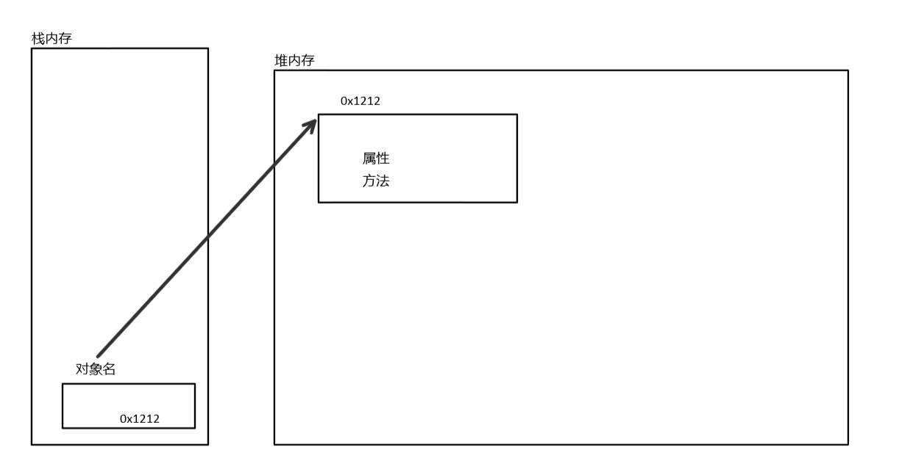

# 类与对象

## 面向对象

OPP：Procedure Oriented Programming   面向过程的编程
OOP：Object Oriented Programming      面向对象的编程

面向过程是具体化的,流程化的： 解决一个问题，你需要一步一步的分析，一步一步的实现。
面向对象是模型化的：  不必去一步一步的实现，至于这个功能是如何实现的，管我们什么事？我们会用就可以了。

**优点：**  
易维护、易复用、易扩展，由于面向对象有封装、继承、多态性的特性，可以设计出低耦合的系统，使系统 更加灵活、更加易于维护。

### 面向对象基本特征

封装 ：将功能封装成一个个独立的单元，减小耦合，避免牵一发而动全身，方便对程序的修改。
继承：代码重用，减少编码量，间接减少维护成本。
多态：不同子类型的对象对同一消息做出不同响应

## 类的创建

- 一个类想要能运行就必须有main方法，java虚拟机会自动检测文件中的main方法，并只执行里边的代码
- 一个java文件中可以写多个类，但只有一个类可以写成`public class 类名`，文件名要与此类名相同，其余类写成`class 类名`
- 类中的属性和方法可写可不写，视情况而定

**例子：**
```java
public class Test{
    //成员变量（属性）
    private int a;
    private int b;

    // 构造方法
    public Test() {}

    public Test(int a, int b) {
        this.a = a;
        this.b = b;
    }

    //成员方法
    public static void show1(int x){
        a = x;
        System.out.printn(a);
    }
    public static void show2(int y){
        b = y;
        System.out.printn(b);
    }
    public static void main(String[] args){
        show1(10);
        show2(11);
    }
}
```

## 实例化对象

```java
class Nine{
    //打印九九乘法表
    public void nine(){
        for(int i=1;i<10;i++){
           for(int k=1;k<i+1;k++){
                int product = k*i;
                System.out.print(k+"*"+i+"="+product+"\t");
           }
           System.out.println(); 
        }
    }
}


public class Show{
    public static void main(String[] args){
        Nine n = new Nine();//实例化对象，为类Nine创建一个名为n的对象
        n.nine();//调用Nine类中的成员方法
        Nine nn;//创建Nine类型的引用数据类型的变量，存储对象在堆中的内存地址
        nn = new Nine();//实例化一个对象，再将对象的内存地址赋给引用变量。
    }
} 
```


**内存结构图**



**注意：**
- 未初始化的对象默认值为null（`String str;`）
