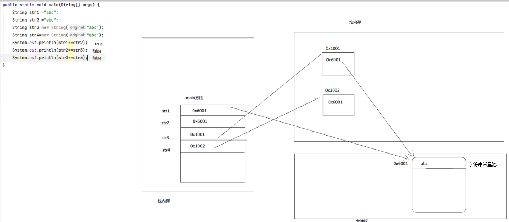

# 字符串

## String类

### 构造器

```text
String()
// 将字节数组转换成字符串
String(byte[] bytes)
// 将字节数组中某段转化成字符串，以第offset个元素起始，长度为length
String(byte[] bytes, int offset, int length)
// 将字符数组转换成字符串
String(char[] chars)
String(char[] char, int offset, int length)
// 创建一个String对象，使其表示一个与参数相同的字符序列
String(String str)
```

### 字符串常量

**Java中定义的String类型字符串都是常量，不可改变。**

**字符串常量内存结构图**




**字符串常量被创建后会被存入方法区的字符串常量池，每当新建一个字符串类型变量时，程序会先在常量池中是否存在该变量所表示的字符串，若存在则变量存储该字符串地址，如果两个字符串变量表示的字符串相同，那么他们的地址相同**

**两个字符串类型变量相加，系统会新建一个字符串常量表示相加后的字符串**


### 常用方法

#### 字符串判断方法

```text
// 判断字符串是否以参数结尾
boolean endsWith(String str)
// 判断两个字符串是否相同
boolean equals(String)
// 忽略大小写比较
boolean equalsIgnoreCase(String str)
// 判断字符串是否包含参数
boolean contains(String str)
// 判断字符串是否以参数开始
boolean startsWith(String str)
// 判断字符串是否为空(不常用，无法用于null)
boolean isEmpty()
// 常用方法（无法用于null）
s.equals("")
```

#### 获取字符串信息方法

```text
// 获取字符串长度
int length()
// 字符串索引从0开始

// 获取参数位置的字符
char charAt(int i)
// 返回参数(ascil码)所代表的字符在字符串中第一次出现的位置
int indexof(int i)
// 返回参数在字符串中第一次出现的位置
int indexof(String str)
// 从整型参数位置后开查找
int indexof(String str, int fromIndex)
// 返回参数位置到字符串结尾所组成的字串
String subString(int beginIndex)
// 返回字符串中[i,j)区间中的字串
String subString(int i, int j)
// 获取字符串对应的字节数组
byte[] getBytes()
// 判断是否以参数字符串开头(有重载)
boolean startsWith(String prefix)
// 判断是否以参数字符串结尾
boolean endsWith(String prefix)
```

#### 其他功能方法

```text
// 将字符串转化为字符数组
char[] toCharArray()
// 将其他类型变量转化为字符串（有多种重载，不常用）
static String valueof(参数)
// 常用方式
int a = 10;
String s = a + "";
// 将字符串中的小写改为大写
String toUpperCase()
// 将字符串中的大写改为小写
String toLowerCaser()
// 根据参数(正则表达式)拆分字符串
String[] split(String regex)
// 将字符串中的oldChar改为newChar
String replace(char oldChar, char newChar)
// 去除字符串开头和结尾的空格
String trim()
```


## StringBuffer类

> 可变字符串

