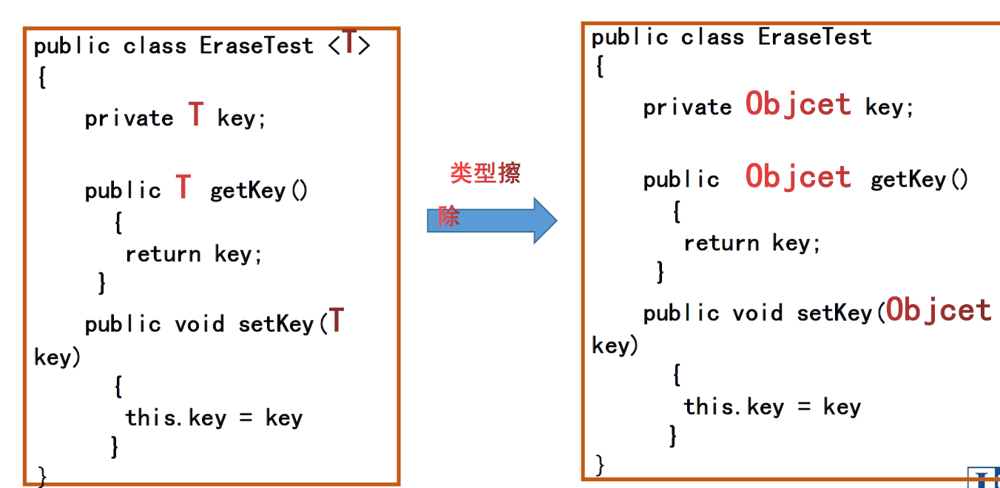
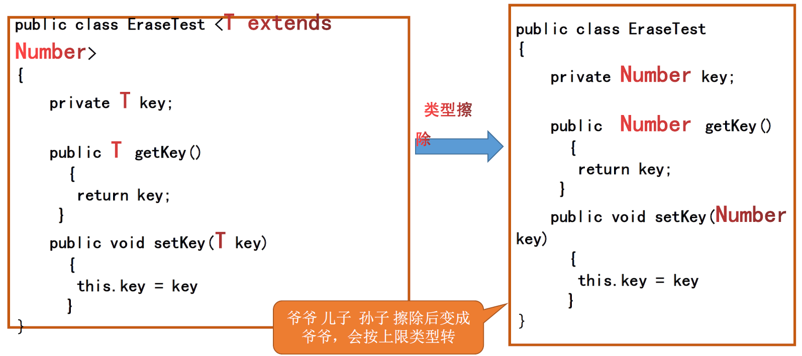
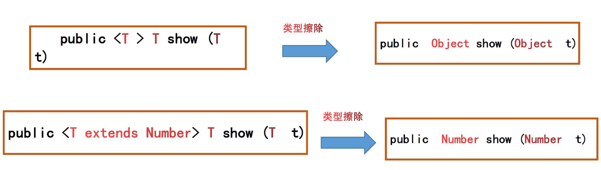
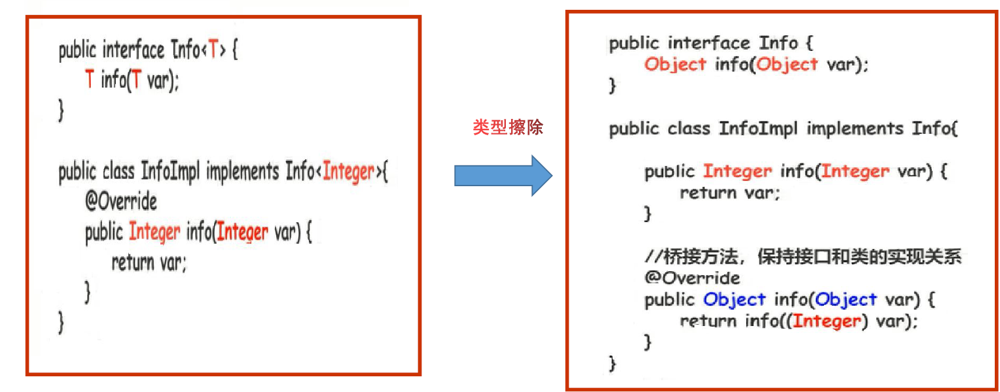

# 泛型

## 本质与特点

1. **实质是参数化数据类型**
2. **优点**
   1. 使代码变简单
   2. 使用时比较安全
   3. 消除对object类的强制转换
3. **局限性**
   1. 泛型参数只能具体为引用类型参数
   2. 一个泛型类创建的多个实例对象不兼容

## 泛型类的定义与使用

```java
class Box<T> {
    /*code*/
}
public class TestClass {
    public static void main(String[] args) {
        Box<Integer> box_1 = new Box<Integer> ();
        Box<String> Box_2 = new Box<String> ();
        /*将泛型参数T具体化，某一个具体类型对象只能接收该类型的数据*/
    }
}
```

## 泛型接口的定义与使用

```java
// 泛型接口
interface Interface<T> {

    void set(T t);
}

// 实现类为泛型类
class Info_1<T> implements Interface<T> {
    public void set(T t) {
        System.out.println(t);
    }
}

// 实现类为具体类型的类
class Info_2 implements Interface<String> {
    public void set(String s) {
        System.out.println(s);
    }
}

public class TestInterface {
    public static void main(String[] args) {
        Info_1<Integer> info_1 = new Info_1<Integer>();
        Info_2 info_2 = new Info_2();
        info_1.set(20);
        info_2.set("string");
    }
}
```

## 泛化方法的定义与使用

**泛型方法要在方法修饰符（public/static/final/abstract等）之后，返回值类型之前声明类型参数，此类型参数作用域仅限于方法内部，调用方法与普通方法一样**

```java
public class Way {
    public static void main(String[] args) {
        Integer i = 20;
        String s = "String";
        show(i);
        show(s);
        System.out.println(print(i));
        System.out.println(print(s));
    }

    public static <T> void show(T t) {
        System.out.println("type:" + t.getClass().getName());
        System.out.println(t);
    }

    public static <T> T print(T t) {
        System.out.println("type:" + t.getClass().getName());
        return t;
    }
}
```

## 泛型参数

### 常用参数

- E — Element ：表示元素，一般在集合类中使用
- K — Key ：表示键值
- V — Value ：表示值
- N — Number ：表示数字
- T — Type ：表式类型
- S、U、V等 ：增加参数，用法Bag<T, S,...>

### 类型参数的限制


```java
public class Class {
    public static void main(String[] args) {
        Box<Number> box = new Box<>(10);
        Box<Number> box2 = new Box<>(1.1);
        /*以上写法表示只能接收Number类型的数据*/
        Box2<Number> box22 = new Box2<>(2.2);
        Box2<Integer> box23 = new Box2<>(20);
    }

}

class Box<T> {
    private T t;

    public Box(T t) {
        this.t = t;
        System.out.println(this.t);
    }
}

// T继承了Number类，只能接收Number类型数据(Number类及其子类)
class Box2<T extends Number> {
    private T n;

    public Box2(T n) {
        System.out.println(this.n = n);
    }
}

```

*其他待整理*

### 通配符

**`<?>` 用于表示任意泛型类型**

```java
public class TongPeiFu {
    public static void main(String[] args) {
        Bag<Double> bag = new Bag<>(1.1);
        Bag<Integer> bag2 = new Bag<>(10);
        print(bag);
        print(bag2);
    }
    public static void print(Bag<?> b) {
        System.out.println(b.get());
    }
}
class Bag<T>{
    private T t;
    public Bag(T t){
        this.t = t;
    }
    public T get() {
        return t;
    }
}
```

## 类型擦除

**定义:泛型只存在代码编译阶段，在进入JVH之前，泛型相关的信息会被擦除掉，我们称之为-类型擦除**


### 泛型类的类型擦除

1. 无限制类型的泛型擦除将泛型类型变成object


2. 有限制类型的泛型擦除将泛型类型变成上限类型。



### 泛型方法类型擦除



### 泛型接口类型擦除

**桥接模式**


