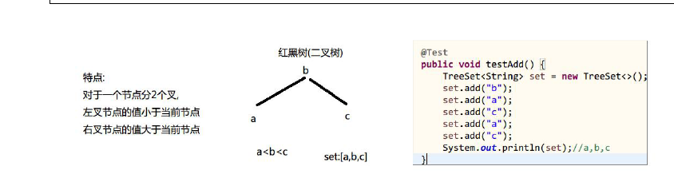

# TreeSet

> ```java
> public class TreeSet<E> extends AbstractSet<E> implements NavigableSet<E>, Cloneable, Serializable
> ```

基于TreeMap 的NavigableSet 实现。使用元素的自然顺序对元素进行排序，或者根据创建set 时提供的Comparator 进行排序，具体取决于使用的构造方法。

## 构造器

```java
public TreeSet()
```
```
构造一个新的空set，该set 根据其元素的自然顺序进行排序。
插入该set 的所有元素都必须实现Comparable 接口。另外，所有这些元素都必须是可互相比较的：对于set 中的任意两个元素e1 和e2，执行e1.compareTo(e2) 都不得抛出ClassCastException。
如果用户试图将违反此约束的元素添加到set（例如，用户试图将字符串元素添加到其元素为整数的set 中），则add 调用将抛出ClassCastException。
```

```java
public TreeSet(Comparator<? super E> comparator)
```
```
构造一个新的空TreeSet，它根据指定比较器进行排序。  
插入到该set 的所有元素都必须能够由指定比较器进行相互比较：对于set 中的任意两个元素e1 和e2，执行comparator.compare(e1, e2) 都不得抛出ClassCastException。  
如果用户试图将违反此约束的元素添加到set 中，则add 调用将抛出ClassCastException。  
参数：
    comparator - 将用来对此set 进行排序的比较器。如果该参数为null，则使用元素的自然顺序。
```

```java
public TreeSet(Collection<? extends E> c)
```
```
构造一个包含指定collection 元素的新TreeSet，它按照其元素的自然顺序进行排序。插入该set 的所有元素都必须实现Comparable 接口。  
另外，所有这些元素都必须是可互相比较的：对于set 中的任意两个元素e1 和e2 ，执行e1.compareTo(e2) 都不得抛出ClassCastException。
参数：
    c - 一个collection，其元素将组成新的set
抛出：
    ClassCastException - 如果c 中的元素不是Comparable，或者是不可相互比较的
    NullPointerException - 如果指定collection 为null
```

```java
public TreeSet(SortedSet<E> s)
```
```
构造一个与指定有序set 具有相同映射关系和相同排序的新TreeSet。
参数：
    s - 一个有序set，其元素将组成新set
抛出：
    NullPointerException - 如果指定有序set 为null
```

## 常用方法

```java
boolean add(E e)
// 将指定的元素添加到此set（如果该元素尚未存在于set 中）。
boolean addAll(Collection<? extends E> c)
// 将指定collection 中的所有元素添加到此set 中。
E ceiling(E e)
// 返回set 中大于等于参数的最小元素；如果不存在这样的元素，则返回null。
void clear()
// 移除此set 中的所有元素。
Object clone()
// 返回TreeSet 实例的浅拷贝副本。
Comparator<? super E> comparator()
// 返回对此set 中的元素进行排序的比较器；如果此set 使用其元素的自然顺序，则返回null。
boolean contains(Object o)
// 如果此set 包含指定的元素，则返回true。
Iterator<E> descendingIterator()
// 返回在此set 元素上按降序进行迭代的迭代器。
NavigableSet<E> descendingSet()
// 返回此set 中所包含元素的逆序视图。
E first()
// 返回此set 中当前第一个（最低）元素。
E floor(E e)
// 返回此set 中小于等于给定元素的最大元素；如果不存在这样的元素，则返回null。
SortedSet<E> headSet(E toElement)
// 返回此set 的部分视图，其元素严格小于toElement。
NavigableSet<E> headSet(E toElement, boolean inclusive)
// 返回此set 的部分视图，其元素小于（或等于，如果inclusive 为true）toElement。
E higher(E e)
// 返回此set 中严格大于给定元素的最小元素；如果不存在这样的元素，则返回null。
boolean isEmpty()
// 如果此set 不包含任何元素，则返回true。
Iterator<E> iterator()
// 返回在此set 中的元素上按升序进行迭代的迭代器。
E last()
// 返回此set 中当前最后一个（最高）元素。
E lower(E e)
// 返回此set 中严格小于给定元素的最大元素；如果不存在这样的元素，则返回null。
E pollFirst()
// 获取并移除第一个（最低）元素；如果此set为空，则返回null。
E pollLast()
// 获取并移除最后一个（最高）元素；如果此set 为空，则返回null。
boolean remove(Object o)
// 将指定的元素从set 中移除（如果该元素存在于此set 中）。
int size()
// 返回set 中的元素数（set 的容量）。
NavigableSet<E> subSet(E fromElement, boolean fromInclusive, E toElement, boolean toInclusive)
// 返回此set 的部分视图，其元素范围从fromElement 到toElement。
SortedSet<E> subSet(E fromElement, E toElement)
// 返回此set 的部分视图，其元素从fromElement（包括）到toElement（不包括）。
SortedSet<E> tailSet(E fromElement)
// 返回此set 的部分视图，其元素大于等于fromElement。
NavigableSet<E> tailSet(E fromElement, boolean inclusive)
// 返回此set 的部分视图，其元素大于（或等于，如果inclusive 为true）fromElement。
```

## 元素排序

TreeSet是使用Comparable接口中的compareTo方法对元素进行排序的，所以要插入集合中的元素所在类必须实现Comparator接口或使用`public TreeSet(Comparator<? super E> comparator)`创建TreeSet对象。




## HashSet 与 TreeSet

**1. HashSet 判断重复元素是根据元素的hashCode()的值是否相等,如果不相等,则不用再去执行equals()方法,两个对象不相等.如果hashCode()的值相等,需要去执行元素的equal()方法,如果返回true 代表像个对象相等,否则两个对象不相等.**
比较的次数是元素的个数-1.

**2. TreeSet 是处于排序状态的set,他的排序是根据元素的内部比较器(元素类本身实现了Comparable 接口,重写CompareTo 方法)或者外部比较器(专门写一个新类,让这个新类实现Comparator 接口,重写Compare()方法),进行比较.TreeSet 实例使用它的compareTo（或compare）方法对所有元素进行比较**
比较的次数是元素的个数-1.
