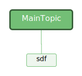

# IO流

流是一串连续不断的数据的集合，就象水管里的水流，在水管的一端一点一点地供水，而在水管的另一端看到的是一股连续不断的水流。数据写入程序可以是一段、一段地向数据流管道中写入数据，这些数据段会按先后顺序形成一个长的数据流。对数据读取程序来说，看不到数据流在写入时的分段情况，每次可以读取其中的任意长度的数据，但只能先读取前面的数据后，再读取后面的数据。不管写入时是将数据分多次写入，还是作为一个整体一次写入，读取时的效果都是完全一样的流是磁盘或其它外围设备中存储的数据的源点或终点

## 分类

### 输入输出流

根据流动方向可分为输入流和输出流，输入或输出是相对流的一端来说的，没有绝对的输入或输出

### 字符流和字节流

**对于输入和输出流，由于传输格式的不同，又分为字节流和字符流：**  

    字节流是指 8 位的通用字节流，以字节为基本单位，在 java.io包中，对于字节流进行操作的类大部分继承于 InputStream（输入字节流）类和 OutputStream（输出字节流）类  
    字符流是指 16 位的 Unicode 字符流，以字符（两个字节）为基本单位，非常适合处理字符串和文本，对于字符流进行操作的类大部分继承于 Reader（读取流）类和 Writer（写入流）类

