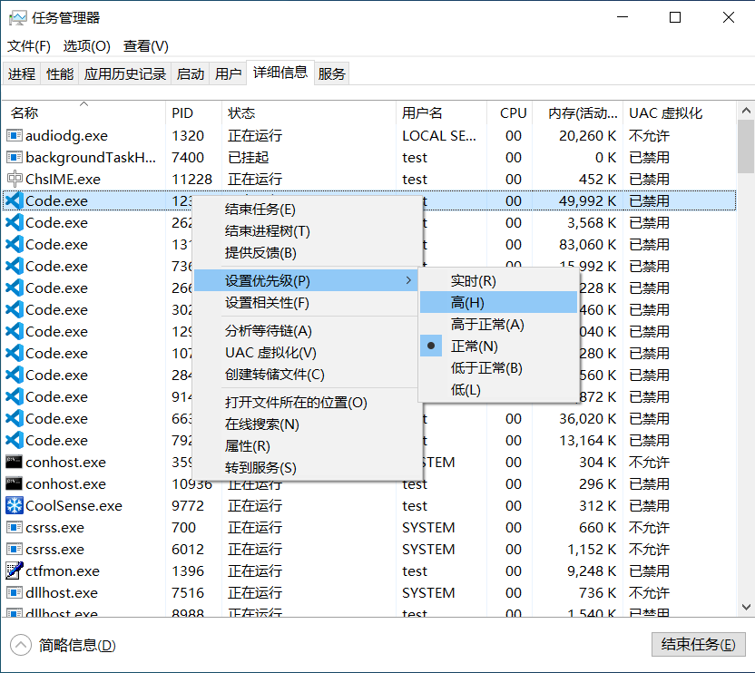

# 线程

> 进程中的一个执行单元，负责当前进程中的程序执行

## 线程调度

* 分时调度：所有线程轮流拥有CPU的使用权，平均分配每个线程占用CPU的时间
* 抢占式调度：优先让优先级高的线程使用CPU，如果线程的优先级相同，则随机选择。Java使用的是抢占式调度。
  * 详解:  
  大部分操作系统都支持多进程并发运行，现在的操作系统几乎都支持同时运行多个程序。比如：现在我们上课一边使用编辑器，一边使用录屏软件，同时还开着画图板，dos窗口等软件。此时，这些程序是在同时运行，“感觉这些软件好像在同一时刻运行着”。实际上，CPU(中央处理器)使用抢占式调度模式在多个线程间进行着高速的切换。对于CPU的一个核而言，某个时刻，只能执行一个线程，而 CPU的在多个线程间切换速度相对我们的感觉要快，看上去就是在同一时刻运行。其实，多线程程序并不能提高程序的运行速度，但能够提高程序运行效率，让CPU的使用率更高。
  * 设置线程优先级
  

