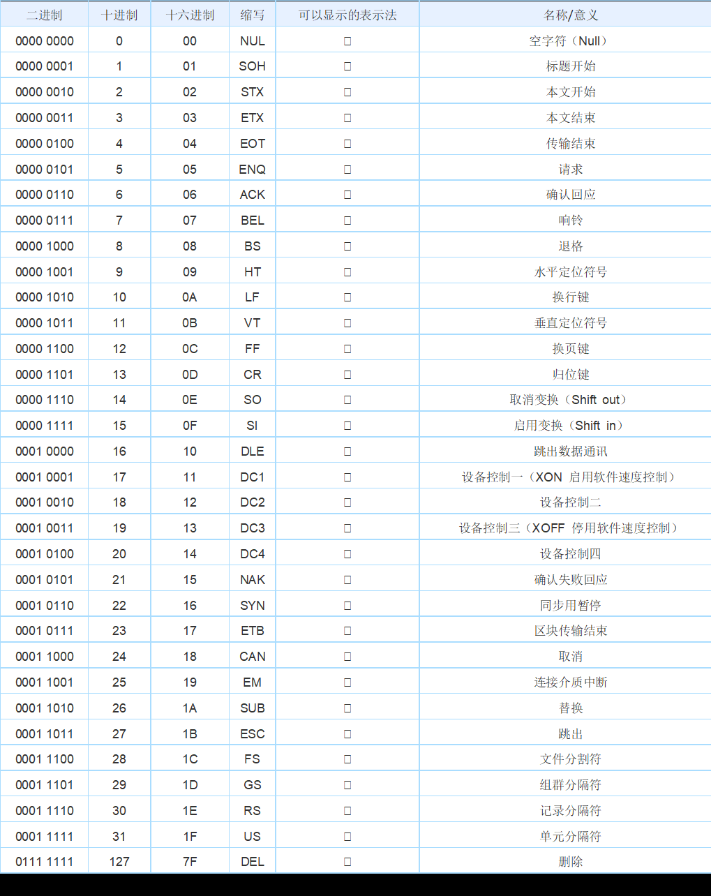
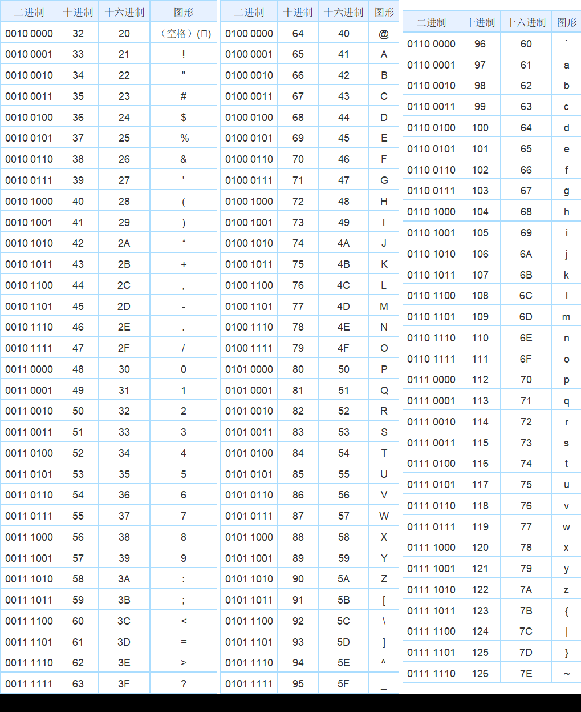

# 计算机编码

## ASCII

ASCII（American Standard Code for Information Interchange，美国信息互换标准代码，ASCⅡ）是基于拉丁字母的一套电脑编码系统。
它主要用于显示现代英语和其他西欧语言。它是现今最通用的单字节编码系统，并等同于国际标准ISO/IEC 646。

ASCII第一次以规范标准的型态发表是在1967年，最后一次更新则是在1986年，至今为止共定义了128个字符，其中33个字符无法显示（这是以现今操作系统为依归，但在DOS模式下可显示出一些诸如笑脸、扑克牌花式等8-bit符号），且这33个字符多数都已是陈废的控制字符。
控制字符的用途主要是用来操控已经处理过的文字，在33个字符之外的是95个可显示的字符，包含用键盘敲下空白键所产生的空白字符也算1个可显示字符（显示为空白）。

## 控制字符

## 可显示字符

## GB2312

GB2312编码适用于汉字处理、汉字通信等系统之间的信息交换
1. 基本集共收入汉字6763个和非汉字图形字符682个
2. 于人名、古汉语等方面出现的罕用字，GB 2312不能处理

## GBK

- 收录2w多个汉字且包含繁体
- 两个字节代表一个字符

## GB18030

支持中国少数民族文字

## Unicode

> 国际组织编码

- 容纳世界上所有的文字和符号
- 两个字节表示一个字符
- 速度快但浪费空间

## UTF-8

- 包含中英文
- 英文字符用一个字节表示，中文字符用三个字节表示