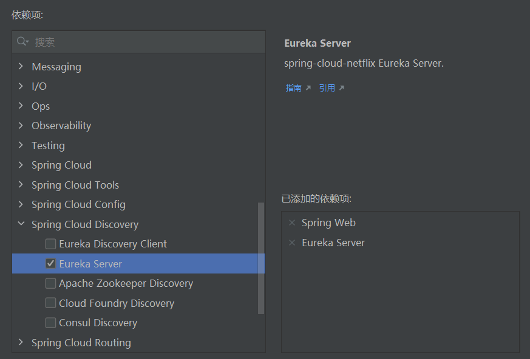

# Eureka

> [https://github.com/Netflix/eureka/wiki](https://github.com/Netflix/eureka/wiki)

Eureka 是一种基于 REST（代表性状态传输）的服务，主要用于 AWS 云中，用于定位服务，以实现中间层服务器的负载平衡和故障转移。 我们将此服务称为 Eureka Server。 Eureka 还附带了一个基于 Java 的客户端组件，即 Eureka Client，它使与服务的交互变得更加容易。 客户端还有一个内置的负载均衡器，可以进行基本的循环负载均衡。 在 Netflix，一个更复杂的负载均衡器封装了 Eureka，以提供基于流量、资源使用、错误条件等多个因素的加权负载均衡，以提供卓越的弹性。

简单的来说 Eureka 是一个服务注册中心，我们可以将业务组件注册到 Eureka 服务器中，其他客户端组件可以向服务器获取服务并远程调用。


## 服务器端

也成为服务注册中心，支持高可用配置。它依托于强一致性提供良好的服务实例可用性，可以应对多种不同的故障场景。如果Eureka以集群模式部署，当集群中有分片出现故障时，那么Eureka就转入自我保护模式。它允许在分片故障期间继续提供服务的发现和注册，当故障分片恢复运行时，集群中的其他分片会把它们的状态再次同步回来。  
对于注册到服务器端的服务组件，Eureka 服务器并没有提供后台的存储，这些注册的服务实例被保存在内存的注册中心，它们通过心跳来保持其最新状态，这些操作都可以在内存中完成。客户端存在着相同的机制，同样在内存中保存了注册表信息，这样的机制提升了Eureka 组件的性能，每次服务的请求都不必经过服务器端的注册中心。

## 服务提供者

作为Eureka 客户端存在的服务提供者，主要进行以下工作：   
1. 向服务器注册服务：
2. 发送心跳给服务器；  
3. 向服务器端获取注册列表。当客户端注册到服务器时，它将会提供一些关于自己的信息给服务器端，例如自己的主机、端口、健康检测连接等。

## 服务调用者

对于发布到Eureka 服务器的服务，服务调用者可对其进行服务查找与调用，服务调用者也是作为客户端存在的，但其职责主要是发现与调用服务。在实际情况中，有可能出现本身既是服务提供者，又是服务调用者的情况，例如在传统的企业应用三层架构中，服务层会调用数据访问层的接口进行数据操作，它本身也会提供服务给控制层使用。

## Spring Cloud Eureka

Spring Cloud Eureka 是Spring Cloud Netflix 微服务套件中的一部分，它基于Netflix Eureka 做了二次封装，主要负责完成微服务架构中的服务治理功能。Spring Cloud 通过为 Eureka 增加了Spring Boot 风格的自动化配置，我们只需通过简单引入依赖和注解配置就能 让Spring Boot 构建的微服务应用轻松地与Eureka 服务治理体系进行整合。  
Spring Cloud Eureka, 使用Netflix Eureka来实现服务注册与发现，它既包含了服务端组件，也包含了客户端组件，并且服务端与客户端均采用Java编写，所以Eureka主要适用于通过Java实现的分布式系统，或是与NM兼容语言构建的系统。但是，由于Eureka服务端的服务治理机制提供了完备的RESTfulAPL，所以它也支持将非Java语言构建的微服务应用纳入Eureka的服务治理体系中来。只是在使用其他语言平台的时候，需要自己来实
现Eureka的客户端程序。不过庆幸的是，在目前几个较为流行的开发平台上，都已经有了一些针对Eureka 注册中心的客户端实现框架，比如.NET平台的Steeltoe、Node.js 的eureka-js-client等。

### 服务注册

在服务治理框架中，通常都会构建一个注册中心，每个服务单元向注册中心登记自己提供的服务，将主机与端口号、版本号、通信协议等一些附加信息告知注册中心，注册中心按服务名分类组织服务清单。比如

服务名 | 位置
---------|----------
 服务A |  92.168.0.100:8000、192.168.0.101:8000
 服务B | 192.168.0.100:9000、192.168.0.101:9000、192.168.0.102:9000 
 
我们有两个提供服务A的进程，另外还有三个提供服务B的进程。当这些进程均启动，并向注册中心注册自己的服务之后，注册中心就会维护类似下面的一个服务清单。
另外，服务注册中心还需要以心跳的方式去监测清单中的服务是否可用，若不可用需要从服务清单中剔除，达到排除故障服务的效果。

### 服务发现

由于在服务治理框架下运作，服务间的调用不再通过指定具体的实例地址来实现，而是通过向服务名发起请求调用实现。所以，服务调用方在调用服务提供方接口的时候，并不知道具体的服务实例位置。因此，调用方需要向服务注册中心咨询服务，并获取所有服务的实例清单，以实现对具体服务实例的访问。
实际的框架为了性能等因素，不会采用每次都向服务注册中心获取服务的方式，并且不同的应用场景在缓存和服务剔除等机制上也会有一些不同的实现策略。

### 简单项目示例

#### 搭建注册中心

使用idea创建 Spring Boot 工程并选择Spring Web、Eureka Server依赖完成工程创建。



在项目主类中添加@EnableEurekaServer注解

编写 Spring Boot 配置

```yml
spring:
  application:
    name: EurekaServer
eureka:
  client:
    service-url:
      defaultZone: http://127.0.0.1:8761/eureka
server:
  port: 8761
```
eureka.client.service-url.defaultZone用来配置注册中心的地址及端口号，以上为默认值。可以自定义端口号，要与server.port一致

#### 搭建服务提供者

使用idea创建 Spring Boot 工程并选择Spring Web、Eureka Discovery Client依赖完成工程创建。


在项目主类中添加@EnableDiscoveryClient注解

编写 Spring Boot 配置

```yml
spring:
  application:
    name: Service
eureka:
  client:
    service-url:
      defaultZone: http://127.0.0.1:8761/eureka
server:
  port: 8081
```

#### 搭建服务调用者

同提供者

#### 搭建服务器集群

搭建两个服务器的集群，复制两份 Spring Boot 配置文件（yml）并分别命名为application-server1.yml、application-server2.yml（-后可自定义），向两份配置文件中分别写入以下内容：

```yml
# server1
spring:
  application:
    name: EurekaServer
eureka:
  client:
    service-url:
      defaultZone: http://127.0.0.1:8762/eureka
server:
  port: 8761
```
```yml
# server2
spring:
  application:
    name: EurekaServer
eureka:
  client:
    service-url:
      defaultZone: http://127.0.0.1:8761/eureka
server:
  port: 8762
```
在项目的运行/调试配置中同样将原有配置复制两份并分别命名为EurekaserverApplication-server1、EurekaserverApplication-server2（可自定义），在新复制的两个配置中增加程序实参，内容分别为--spring.profiles.active=server1、--spring.profiles.active=server2，server1、server2是上一步复制的配置文件的application-后的名称，该参数可以设置运行项目是所使用的配置文件。

完成上面两部后分别启动EurekaserverApplication-server1、EurekaserverApplication-server2即可

#### 搭建服务提供者集群

搭建两个服务器的集群，复制两份 Spring Boot 配置文件（yml）并分别命名为application-service1.yml、application-service2.yml（-后可自定义），将里边的eureka.client.service-url.defaultZone改为 `http://127.0.0.1:8761/eureka,http://127.0.0.1:8762/eureka` （用几个服务器写几个，用逗号分隔）

按搭建服务器集群的方法复制出两份服务提供者的运行/调试配置

分别运行两个配置
