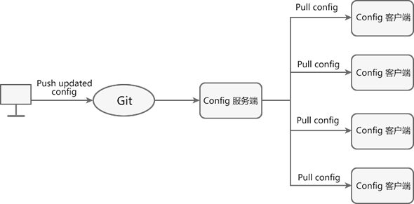

# Spring Cloud Config

微服务的最大特点就是一个项目会包含很多模块，每个模块都会有相关配置，多个模块中可能有大量重复配置，Spring Cloud Config 可以实现在项目外部集中化、动态的管理配置。国内配置中心项目：百度的 Disconf、淘宝的 diamond、360 的 QConf、携程的 Apollo 等。

简单的来说就是将所有微服务中的公共配置统一放到外部仓库或者系统中并由配置中心进行管理。

Spring Cloud Config 包含以下两个部分：
- Config Server：分布式配置中心，它是一个独立运行的微服务应用，用来连接配置仓库并为客户端提供获取配置信息、加密信息和解密信息的访问接口。
- Config Client：微服务架构中的各个微服务，它们通过 Config Server 对配置进行管理，并从 Config Sever 中获取和加载配置信息。

Spring Cloud Config 默认使用 Git 存储配置信息，支持对微服务配置的版本管理。除了 Git 外，Spring Cloud Config 还支持 SVN、本地化文件系统等。

## 工作原理




在需要更改微服务的公共配置时，只需更改外部仓库中的配置即可应用到所有微服务中。

工作流程：
1. 开发或运维人员提交配置文件到远程的 Git 仓库。
2. Config 服务端负责连接配置仓库 Git，并对 Config 客户端暴露获取配置的 REST 接口。
3. Config 客户端通过 Config 服务端暴露出来的 REST 接口，拉取配置仓库中的配置。
4. Config 客户端获取到配置信息，以支持服务的运行。

## 案例搭建

1. 搭建好注册中心、网关模块
2. 搭建配置中心模块
   1. 在GitHub或Gitee上创建仓库并添加配置文件
      - 配置文件命名规则：{application}-{profile}.{后缀名} （config-dev.yml）
        - application：文件名
        - profile：部署环境
   2. 在idea中选择 Spring Initializr模板，添加 Spring Web、Config Server 依赖，如果要将配置中心注册到注册中心还可以加上 Eureka（或其他注册中心）
   3. 在主类中加入 @EnableConfigServer 注解（和 @EnableEurekaClient）
   4. 配置文件
    ```properties
    server.port=8888
    spring.application.name=configServer
    # 远程仓库地址
    spring.cloud.config.server.git.uri=https://gitee.com/silent-passer/spring-cloud-config.git
    # 远程仓库名
    spring.cloud.config.server.git.search-paths=spring-cloud-config
    # 私有仓库要配置需要登陆并配置用户名和密码
    #spring.cloud.config.server.git.force-pull=true
    #spring.cloud.config.server.git.username=uuu
    #spring.cloud.config.server.git.password=222
    # 要引用的配置文件在远程仓库中的分支
    spring.cloud.config.label=develop

    eureka.client.service-url.defaultZone=http://localhost:8080/eureka
    ```
3. 搭建服务提供者模块
   1. 在idea中选择 Spring Initializr模板，添加 Spring Web、Eureka Discovery Client、Config Client 依赖
   2. 在主类中添加 @EnableEurekaClient 注解
   3. 配置文件
   ```properties
   server.port=8081
   spring.application.name=Provider
   eureka.client.service-url.defaultZone=http://localhost:8080/eureka

   # 允许使用 DiscoveryClient 来定位 Config Serve
   spring.cloud.config.discovery.enabled=true
   # 存储配置文件的仓库分支名
   spring.cloud.config.label=develop
   # 配置文件名（config-dev.yml）
   spring.cloud.config.name=config
   # 配置文件所属环境名（config-dev.yml）
   spring.cloud.config.profile=dev
   # 配置中心url
   #spring.config.import=optional:configserver:http://localhost:8888
   # 使用注册中心要在本文件中配置注册中心的defaultZone，在仓库中配置的无法生效
   spring.config.import=optional:configserver:http://CONFIGSERVER
   ``` 
   注：声明配置中心还可以使用 spring.cloud.config.uri，但是需要 bootstrap 依赖，详见[官网](https://docs.spring.io/spring-cloud-config/docs/current/reference/html/#config-first-bootstrap)

   4. 写一个 controller 验证能否获取到仓库中指定配置文件的内容
   ```java
   import org.springframework.beans.factory.annotation.Value;
   import org.springframework.web.bind.annotation.GetMapping;
   import org.springframework.web.bind.annotation.RestController;
   //读取配置中心指定配置文件的内容，并展示到页面
   @RestController
   public class ConfigClientController {
      @Value("${server.port}")
      private String serverPort;
      @Value("${config.info}")
      private String configInfo;
      @Value("${config.version}")
      private String configVersion;
      @GetMapping(value = "/getConfig")
      public String getConfig() {
         return "info：" + configInfo + "<br/>version：" + configVersion + "<br/>port：" + serverPort;
      }
   }
   ```


通过在配置中心的url加上下面的其中一个来查看仓库中对应文件内容
```text
/{application}/{profile}[/{label}]
/{application}-{profile}.yml
/{label}/{application}-{profile}.yml
/{application}-{profile}.properties
/{label}/{application}-{profile}.properties
```


   
