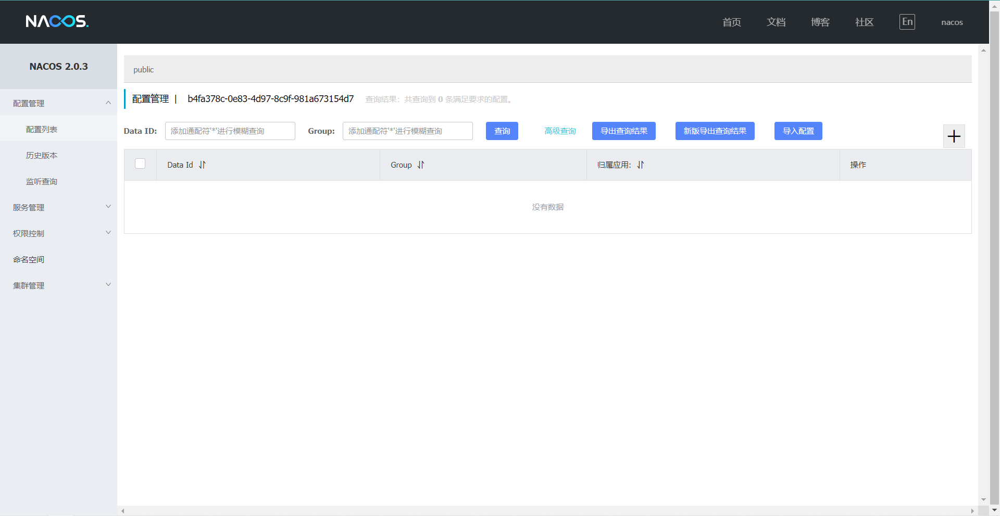
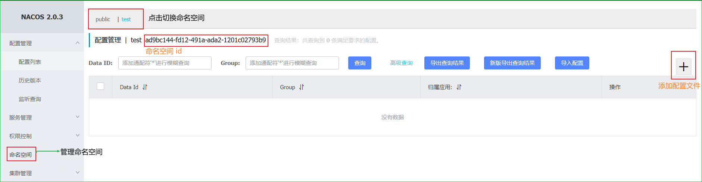
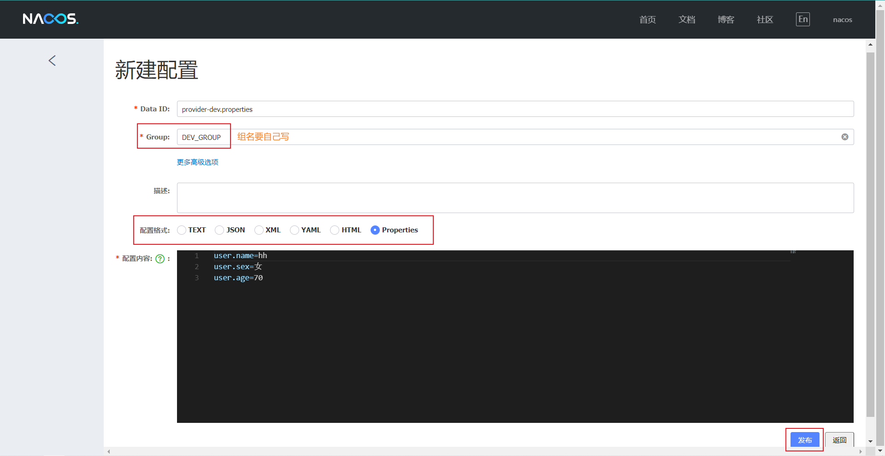
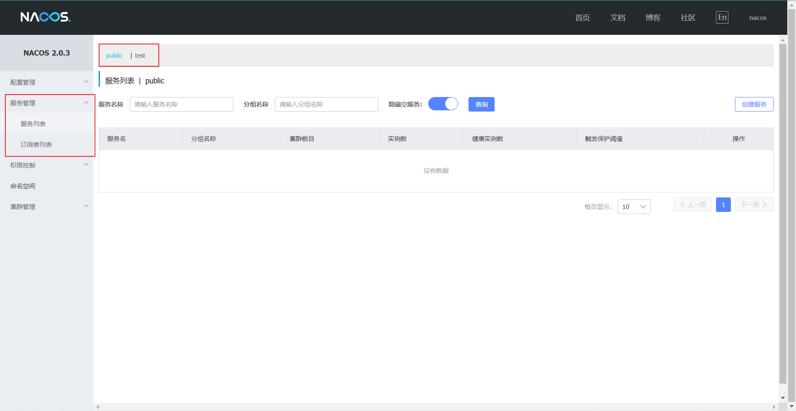

# Nacos

[官网文档](https://nacos.io/zh-cn/docs/what-is-nacos.html)

Nacos 致力于帮助您发现、配置和管理微服务。Nacos 提供了一组简单易用的特性集，帮助您快速实现动态服务发现、服务配置、服务元数据及流量管理。
Nacos 支持几乎所有主流类型的“服务”的发现、配置和管理：Kubernetes Service、gRPC & Dubbo RPC Service、Spring Cloud RESTful Service

Nacos 前两个字母是 Naming 的缩写，co 是 Configuration 的缩写，s 是 Service 的缩写。

总的来说 Nacos 包括服务中心和配置中心的功能，是 Eureka + Config + Bus 的替代。

## 安装

Nacos 提供了本地服务程序，支持 Linux/Unix/Mac/Windows，推荐选用 Linux/Unix/Mac。可以从 [GitHub](https://github.com/alibaba/nacos/releases) 仓库下载，官方**当前**推荐的稳定版本是 [2.0.3](https://github.com/alibaba/nacos/releases/tag/2.0.3) 。同时本地还有要有 [JDK 1.8](http://www.oracle.com/technetwork/java/javase/downloads/jdk8-downloads-2133151.html) 或更高版本，且已经配置好 JAVA_HOME。  
下载好压缩包直接解压到合适位置就行。

如果是克隆的项目源码，本地还要有 [Maven 3.2.x](https://maven.apache.org/download.cgi) 或更高版本，并配置好环境变量。
```shell
git clone https://github.com/alibaba/nacos.git
cd nacos/
mvn -Prelease-nacos -Dmaven.test.skip=true clean install -U  
ls -al distribution/target/

// change the $version to your actual path
cd distribution/target/nacos-server-$version/nacos/bin
```

## 使用

### 启动服务器

进入 nacos 的 bin 目录
*Linux/Unix/Mac*
启动命令(standalone代表着单机模式运行，非集群模式):  
`sh startup.sh -m standalone`
如果是ubuntu系统，或者运行脚本报错提示[[符号找不到，尝试：  
`bash startup.sh -m standalone`

*Windows*
启动命令(standalone代表着单机模式运行，非集群模式):  
`startup.cmd -m standalone`

### 关闭服务器

*Linux/Unix/Mac*
`sh shutdown.sh`

*Windows*
`shutdown.cmd`

### 配置中心

启动 Nacos 服务器后在浏览器中打开 http://localhost:8848/nacos 即可打开 Nacos 服务器的图形界面，可以在网站上管理存储在 Nacos 服务器中的配置。网站默认账号密码为 `nacos`。登录成功后进入主界面


Nacos 根据命名空间（namespace，默认：public）、组（group， 默认：DEFAULT_GROUP）和配置文件名（dataId） 来区分配置，其中命名空间范围最大。

dataId 格式：  
`${prefix}-${spring.profiles.active}.${file-extension}`
- prefix 默认为 `spring.application.name` 的值，也可以通过配置项 `spring.cloud.nacos.config.prefix`来配置。
- profile 表示项目环境，使用`spring.profiles.active`配置。注意：当 `spring.profiles.active`为空时，对应的连接符 - 也将不存在，dataId 的拼接格式变成 ${prefix}.${file-extension}
- file-exetension 为配置内容的数据格式，可以通过配置项 `spring.cloud.nacos.config.file-extension` 来配置。目前只支持 properties 和 yaml 类型。

**添加配置文件**




### 注册中心

注册中心使用命名空间、组和服务名来区分注册的服务


### 数据持久化

Nacos 服务器默认将用户、配置等数据存到内嵌的数据库中，0.7版本之后支持将内嵌数据库换为 MySQL。

- MySQL 版本 5.6.5+
- 根据conf目录中的 nacos-mysql.sql 文件建库建表
- 修改conf目录中的application.properties文件，增加支持mysql数据源配置（目前只支持mysql）,**注意url参数中的时区要与系统时区一致**
    ```properties
    spring.datasource.platform=mysql

    ### Count of DB:
    db.num=1

    ### Connect URL of DB:
    db.url.0=jdbc:mysql://127.0.0.1:3306/nacos_config?characterEncoding=utf8&connectTimeout=1000&socketTimeout=3000&autoReconnect=true&useUnicode=true&useSSL=false&serverTimezone=UTC
    db.user.0=nacos
    db.password.0=nacos
    ```
- 再以单机模式启动nacos，nacos嵌入式数据库中的所有数据都写到了mysql


## 项目搭建

### 服务提供者

使用IDEA新建一个空项目并添加模块，选择依赖时只选 Spring Web，Spring Boot 版本随意（建完后再改）

[Spring Cloud Alibaba 版本说明](版本说明.md)（照搬 [Wiki](https://github.com/alibaba/spring-cloud-alibaba/wiki/%E7%89%88%E6%9C%AC%E8%AF%B4%E6%98%8E)，防止Github打不开，尽量同步更新）


**pom.xml**
```xml
<!-- 在 properties 中添加 -->
<spring-cloud-alibaba.version>2.2.7.RELEASE</spring-cloud-alibaba.version>
<!-- 在 project 中添加 -->
<dependencyManagement>
    <dependencies>
        <dependency>
            <groupId>com.alibaba.cloud</groupId>
            <artifactId>spring-cloud-alibaba-dependencies</artifactId>
            <version>${spring-cloud-alibaba.version}</version>
            <type>pom</type>
            <scope>import</scope>
        </dependency>
    </dependencies>
</dependencyManagement>
<!-- 在 dependencies 中添加 -->
<dependency>
    <groupId>com.alibaba.cloud</groupId>
    <artifactId>spring-cloud-starter-alibaba-nacos-discovery</artifactId>
</dependency>
<dependency>
    <groupId>com.alibaba.cloud</groupId>
    <artifactId>spring-cloud-starter-alibaba-nacos-config</artifactId>
</dependency>
```

**bootstrap.properties**
```properties
server.port=8080
spring.application.name=provider
# spring.cloud.nacos.discovery.server-addr 和 spring.cloud.nacos.config.server-addr 默认值
spring.cloud.nacos.server-addr=localhost:8848
# 命名空间 id（服务要注册到哪个命名空间）
spring.cloud.nacos.discovery.namespace=b4fa378c-0e83-4d97-8c9f-981a673154d7
# 组名（注册到命名空间的哪个组）
spring.cloud.nacos.discovery.group=DEV_GROUP

# 配置中心相关设置
spring.cloud.nacos.config.namespace=b4fa378c-0e83-4d97-8c9f-981a673154d7
spring.cloud.nacos.config.group=DEV_GROUP
# 配置中心中配置的文件类型
spring.cloud.nacos.config.file-extension=properties
# 环境名
spring.profiles.active=dev

```

**主类**

添加 @EnableDiscoveryClient

**Controller**

@RefreshScope 注解实现配置动态刷新

```java
package com.example.provider.controller;

import org.springframework.beans.factory.annotation.Value;
import org.springframework.cloud.context.config.annotation.RefreshScope;
import org.springframework.web.bind.annotation.RequestMapping;
import org.springframework.web.bind.annotation.RestController;

import javax.servlet.http.HttpServlet;
import javax.servlet.http.HttpServletRequest;

/**
 * @author passer
 * @version V0.0.1
 */
@RestController
@RefreshScope
public class ConfigController {
    @Value("${user.name}")
    private String userName;
    @Value("${user.age}")
    private String userAge;
    @Value("${user.sex}")
    private String userSex;

    @RequestMapping("/config")
    public String getConfig() {
        return "user name :" + userName + "<br> age: " + userAge + "<br> sex: " + userSex;
    }
}
```

### 网关服务器

新建模块，选择Gateway依赖
 
**pom.xml**  
```xml
<!-- 在 properties 中添加 -->
<spring-cloud.version>Hoxton.SR12</spring-cloud.version>
<spring-cloud-alibaba.version>2.2.7.RELEASE</spring-cloud-alibaba.version>

    
<!-- 在 dependencies 中添加 -->
<dependency>
    <groupId>com.alibaba.cloud</groupId>
    <artifactId>spring-cloud-starter-alibaba-nacos-discovery</artifactId>
</dependency>
<dependency>
    <groupId>com.alibaba.cloud</groupId>
    <artifactId>spring-cloud-starter-alibaba-nacos-config</artifactId>
</dependency>

<!-- 在 dependencyManagement 中添加 -->         
<dependency>
    <groupId>com.alibaba.cloud</groupId>
    <artifactId>spring-cloud-alibaba-dependencies</artifactId>
    <version>${spring-cloud-alibaba.version}</version>
    <type>pom</type>
    <scope>import</scope>
</dependency>
```

**bootstrap.properties**  
```properties
server.port=8083
spring.application.name=gateway

spring.cloud.nacos.server-addr=localhost:8848
spring.cloud.nacos.discovery.namespace=b4fa378c-0e83-4d97-8c9f-981a673154d7
spring.cloud.nacos.discovery.group=DEV_GROUP

spring.cloud.nacos.config.namespace=b4fa378c-0e83-4d97-8c9f-981a673154d7
spring.cloud.nacos.config.group=DEV_GROUP
spring.cloud.nacos.config.file-extension=properties
spring.profiles.active=dev
```

**主类**

添加 @EnableDiscoveryClient


