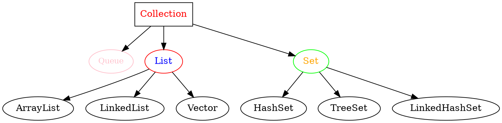

# Collection

## 常用子接口




## 常用方法

```java
int size(); //返回集合对象中元素个数
boolean isEmpty(); //判断是否为空，为空返回true
boolean contains(Object j); //判断集合中是否包含参数
boolean containsAll(Collection c); //判断集合中是否包含参数集合
boolean add(Object obj); //向集合中添加元素
boolean addAll(Collection<?> c); //将参数集合添加到原集合
boolean remove(Object obj); //删除集合元素
boolean remove(Collection c); //你懂的
boolean retainAll(Collection c); //删除集合中除参数外所有元素
void clear(); //清空集合元素
Object[] toArray(); //将集合转换成数组
Iterator<E> iterator(); // 返回集合迭代器
```

## Iterator（迭代器）


